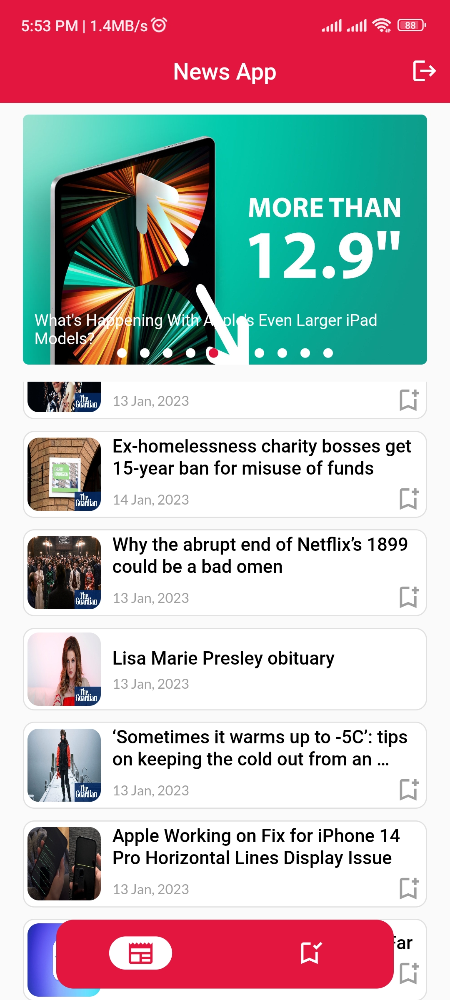
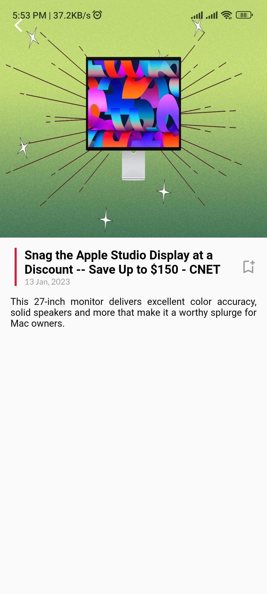
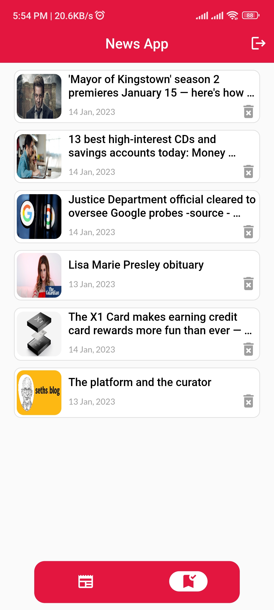
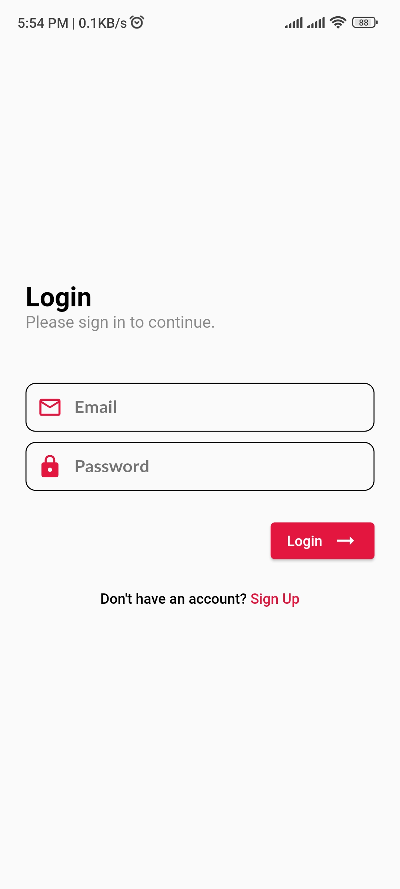
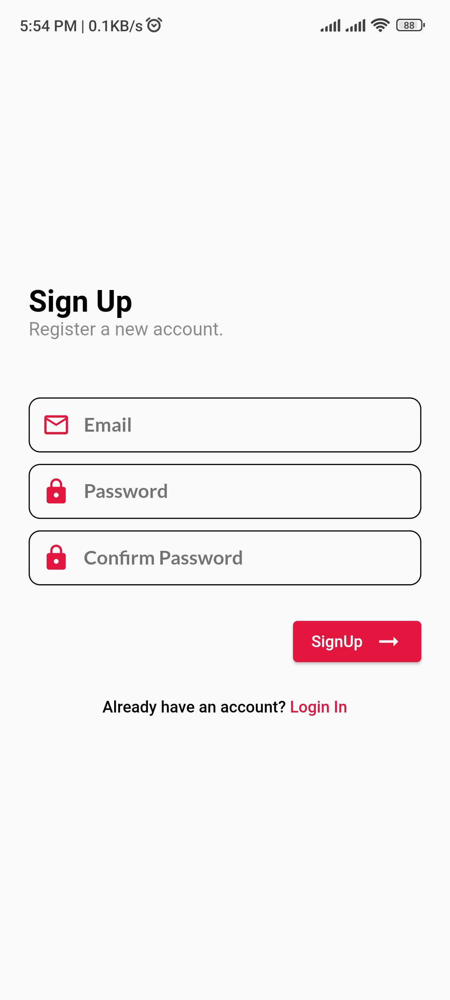

# News App
This app has been created using Flutter

# Contents
* Daily News
* Responsive UI
* Offline Bookmark
* User Authentication
* GetX state management

# Dependencies
* google_fonts: ^3.0.1
* dio: ^4.0.6
* intl: ^0.17.0
* get: 4.6.5
* carousel_slider: ^4.2.1
* firebase_core: ^2.4.1
* cloud_firestore: ^4.3.1
* firebase_auth: ^4.2.5
* sqflite: ^2.2.2
* cached_network_image: ^3.2.3
* path: ^1.8.2
* another_flushbar: ^1.12.29

# APK
<a href="https://github.com/HA-Qodex/newsapp/blob/master/apk%20file/app-release.apk" target="blank" />

# Screenshots
  
  

